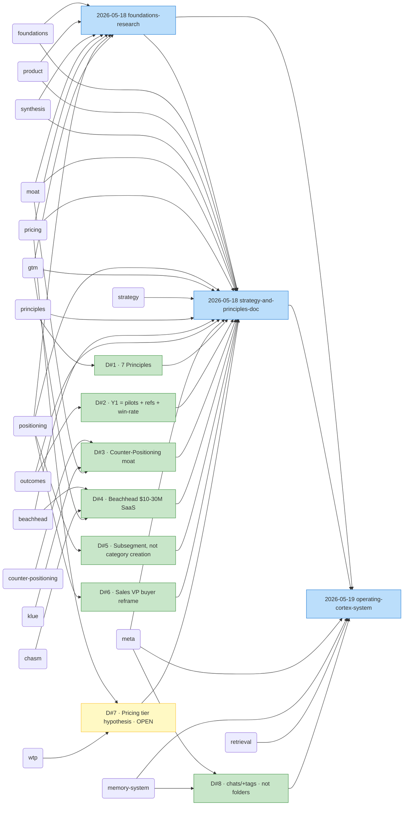

# Kompete Knowledge Graph

> **Auto-generated** initial seed by the graph-builder convention at 2026-05-20.
> Derived from chat frontmatter + decision-log + strategy doc.
> Re-run via `Agent` tool with `subagent_type: graph-builder` whenever you want a refresh. *(Note: this initial generation was done manually; the graph-builder subagent at `~/.claude/agents/graph-builder.md` will run it natively from the next Claude Code session onward.)*

---

## 1. Snapshot

| Count | Of |
|---|---|
| 3 | Chat entries |
| 8 | Durable decisions (1 open: pricing) |
| 25 | Distinct tags in use |
| 7 | Outcomes (KRs) touched (all 7 Y1 KRs covered by strategy doc session) |
| 21+ | Artifacts referenced |
| 2026-05-18 → 2026-05-19 | Date range |

---

## 2. Concept graph (Mermaid)

The most-connected nodes from the current corpus. Decisions in green; chat entries in blue; concept hubs in orange.



> **Reading the diagram:** an edge `Pricing → C2` means the chat C2 carried `pricing` as a tag; an edge `D3 → C2` means decision #3 was made in chat C2; an edge `CounterPositioning → D3` means decision #3 was tagged with `counter-positioning`. Chat-to-chat edges encode `related-chats` (one builds on another).
>
> The two most-central nodes today are **C2 (strategy-and-principles-doc)** and **Moat / Counter-Positioning**. Expected at this stage; the strategy doc is the anchor.

---

## 3. Tag cross-reference

Tags sorted by frequency. Format: `tag — chat-slugs`.

### Domain tags
| Tag | Chats |
|---|---|
| `product` | foundations-research, strategy-and-principles-doc |
| `pricing` | foundations-research, strategy-and-principles-doc |
| `positioning` | foundations-research, strategy-and-principles-doc |
| `gtm` | foundations-research, strategy-and-principles-doc |
| `discovery` | foundations-research |
| `ops` | operating-cortex-system |
| `klue` | (only via decision tags so far) |

### Concept tags
| Tag | Chats |
|---|---|
| `foundations` | foundations-research, strategy-and-principles-doc |
| `moat` | foundations-research, strategy-and-principles-doc |
| `synthesis` | foundations-research, strategy-and-principles-doc |
| `beachhead` | strategy-and-principles-doc |
| `counter-positioning` | (decision tag — D#3) |
| `chasm` | (decision tag — D#4) |
| `dunford` | (decision tag — D#5) |
| `7-powers` | (decision tag — D#3) |
| `icp` | (decision tag — D#4) |
| `wtp` | (decision tag — D#7) |
| `monetization` | (decision tag — D#7) |
| `decoy` | (decision tag — D#7) |
| `buyer` | (decision tag — D#6) |
| `category` | (decision tag — D#5) |

### Operational tags
| Tag | Chats |
|---|---|
| `research` | foundations-research |
| `synthesis` | foundations-research, strategy-and-principles-doc |
| `decision` | strategy-and-principles-doc, operating-cortex-system |
| `meta` | strategy-and-principles-doc, operating-cortex-system |
| `system-design` | operating-cortex-system |

### Outcome tags
| Tag | Chats |
|---|---|
| `kr1-pilots`, `kr2-references`, `kr3-win-rate`, `kr4-adoption`, `kr5-trigger-precision`, `kr6-commercial`, `kr7-pmm-time-saved` | strategy-and-principles-doc (all touched in §VI of strategy doc) |

---

## 4. Outcome → chats index

| Outcome | Chats |
|---|---|
| `kr1-pilots` (5 pilot customers signed) | 2026-05-18-strategy-and-principles-doc |
| `kr2-references` (3 named-public references) | 2026-05-18-strategy-and-principles-doc |
| `kr3-win-rate` (≥10pp win-rate lift) | 2026-05-18-strategy-and-principles-doc |
| `kr4-adoption` (≥70% AE adoption in 30 days) | 2026-05-18-strategy-and-principles-doc |
| `kr5-trigger-precision` (≥80% alerts relevant) | 2026-05-18-strategy-and-principles-doc |
| `kr6-commercial` (≥1 paid commitment) | 2026-05-18-strategy-and-principles-doc |
| `kr7-pmm-time-saved` (≥80% PMM time reduction) | 2026-05-18-strategy-and-principles-doc |

> **Pattern:** every Y1 KR currently has exactly one chat — the strategy session that defined them. Future chats moving these KRs forward will show up here over time, making the diff visible.

---

## 5. Decision provenance chains

```
Decision #1 — Adopt 7 first principles
   ↑ codified in: kompete-research/strategy-and-principles.md §IV
   ↑ decided in: 2026-05-18-strategy-and-principles-doc
   ↑ informed by: 2026-05-18-product-foundations-research
   tags: principles, product, foundations
   status: Active

Decision #2 — Y1 success = 5 pilots + 3 references + ≥10pp win-rate
   ↑ codified in: kompete-research/strategy-and-principles.md §VI
   ↑ decided in: 2026-05-18-strategy-and-principles-doc
   ↑ informed by: 2026-05-18-product-foundations-research
   tags: outcomes, product, gtm
   status: Active

Decision #3 — Counter-Positioning primary moat; aggregate-intel secondary
   ↑ codified in: kompete-research/strategy-and-principles.md §V
   ↑ decided in: 2026-05-18-strategy-and-principles-doc
   ↑ informed by: 2026-05-18-product-foundations-research (Helmer 7 Powers)
   tags: moat, counter-positioning, klue, 7-powers
   status: Active

Decision #4 — Beachhead = $10–30M ARR Series B B2B SaaS sales orgs (specific criteria)
   ↑ codified in: kompete-research/strategy-and-principles.md §II
   ↑ decided in: 2026-05-18-strategy-and-principles-doc
   ↑ informed by: 2026-05-18-product-foundations-research (Moore + 27 interviews)
   tags: beachhead, icp, chasm, gtm
   status: Active

Decision #5 — Subsegment domination Y1–2; "Deal Intelligence" category seeds Y2+
   ↑ codified in: kompete-research/strategy-and-principles.md §III
   ↑ decided in: 2026-05-18-strategy-and-principles-doc
   ↑ informed by: 2026-05-18-product-foundations-research (Dunford)
   tags: positioning, category, dunford
   status: Active

Decision #6 — Sales VP buyer (not PMM); deal-intelligence language
   ↑ codified in: kompete-research/strategy-and-principles.md §III
   ↑ decided in: 2026-05-18-strategy-and-principles-doc
   ↑ informed by: 2026-05-18-product-foundations-research (Dunford + Cagan)
   tags: positioning, buyer, gtm
   status: Active

Decision #7 — Pricing tier hypothesis $0/$799/$1499/Enterprise · OPEN
   ↑ codified in: kompete-research/strategy-and-principles.md §I (Options & Tests)
   ↑ decided in: 2026-05-18-strategy-and-principles-doc
   ↑ informed by: 2026-05-18-product-foundations-research (Ramanujam + Lehrskov-Schmidt + Ariely)
   tags: pricing, wtp, monetization, decoy
   status: OPEN — pending WTP-conversation validation with 10 prospects

Decision #8 — Flat chats/ + tags (not thread folders)
   ↑ codified in: kompete-research/chats/README.md
   ↑ decided in: 2026-05-19-operating-cortex-system
   ↑ informed by: user correction during 2026-05-19 session
   tags: meta, memory-system, retrieval, ops
   status: Active
```

> **Pattern:** 7 of 8 decisions trace to the strategy-doc session, which itself builds on the foundations research. The corpus has a clear *spine* (research → strategy → system) that future chats branch off of. Easy to maintain at this scale; we'll need denser cross-linking when chats hit ~20+.

---

## 6. Artifact provenance

In chronological order of first touch:

| Artifact | First touched | Notes |
|---|---|---|
| `memory/product-foundations/*` (16 files) | 2026-05-18-product-foundations-research | Created reference reading |
| `memory/MEMORY.md` | 2026-05-18-product-foundations-research, 2026-05-18-strategy-and-principles-doc, 2026-05-19-operating-cortex-system | The index file; updated by every system-level session |
| `kompete-research/strategy-and-principles.md` | 2026-05-18-strategy-and-principles-doc | The anchor — codifies decisions 1–7 |
| `kompete-research/chats/README.md` | 2026-05-19-operating-cortex-system | The Operating Cortex convention |
| `kompete-research/decision-log.md` | 2026-05-19-operating-cortex-system | The decision-log itself; appended by each chat that makes a durable decision |
| `kompete-research/chats/20*.md` (3 entries so far) | 2026-05-19-operating-cortex-system (retro + this) | The flat log; one file per session |

**Referenced (not modified):**
- `kompete-research/market-validation/issue-trees/task5-product-form-factor.md` — referenced by foundations-research and strategy-and-principles-doc
- `kompete-research/synthesis/ci-thesis-analysis.md` — referenced by both
- `kompete-research/synthesis/mvp-demo-plan.md` — referenced by strategy-and-principles-doc; flagged for outcome-language rewrite

---

## 7. Open questions surfaced (across all chats)

Aggregated from "Open questions / next steps" sections, deduped:

| Question / next step | First surfaced | Status |
|---|---|---|
| Rewrite `mvp-demo-plan.md` to outcome-language per strategy doc §VI | 2026-05-18-strategy-and-principles-doc | Queued |
| Mom-Test audit of 27 interviews (separate concrete past behavior from "would-you-pay" fluff) | 2026-05-18-product-foundations-research, 2026-05-18-strategy-and-principles-doc | Queued |
| Run 10 WTP conversations to validate/raise pricing tier hypothesis (D#7) | 2026-05-18-strategy-and-principles-doc | Queued · blocks D#7 close |
| Write "Why won't Klue copy us?" one-pager to pressure-test D#3 | 2026-05-18-strategy-and-principles-doc | Queued |
| Build live Opportunity Solution Tree + adopt Product Kata weekly | 2026-05-18-strategy-and-principles-doc | Queued |
| Spec the Whole Product (battlecard library, onboarding, CS motion) | 2026-05-18-strategy-and-principles-doc | Queued |
| 3 named-public-reference customers in 6 months as #1 GTM goal | 2026-05-18-strategy-and-principles-doc | Queued (depends on pilots) |
| Decide on auto-trigger hook for chat-logger (currently soft-reminder) | 2026-05-19-operating-cortex-system | Resolved 2026-05-20 (soft-reminder built) |
| Migrate Zeropearl conversation to chats/ convention | 2026-05-19-operating-cortex-system | Parallel chat's decision; not blocking |
| Tag-vocabulary canonical convergence after ~20 entries | 2026-05-19-operating-cortex-system | Future |

---

## 8. Recent activity (last 7 days, in date order)

| Date | Title | Key tags |
|---|---|---|
| 2026-05-19 | Operating Cortex system design & build | meta, memory-system, retrieval, ops, decision |
| 2026-05-18 | Strategy & principles doc | strategy, principles, foundations, synthesis, decision, moat, beachhead, positioning, pricing, gtm, outcomes, meta |
| 2026-05-18 | Product foundations research (13 books) | foundations, product, pricing, gtm, positioning, moat, discovery, research, synthesis |

---

## What's NOT in this graph yet (worth knowing)

- **The Zeropearl-VC chat** lives at `kompete-research/investor-conversations/zeropearl-vc-jai.md` — it has not adopted the chats/ convention yet, so it doesn't appear here. If that parallel chat migrates (or simply tag-references its file), it'll start showing up.
- **The 27 interviews** at `kompete-research/interviews/` — they predate the Operating Cortex and don't have frontmatter. They're referenced as a corpus by chats 1 and 2 but aren't nodes.
- **The issue trees** at `kompete-research/market-validation/issue-trees/` — same story; predate this system, referenced not nodes.

If we ever want these in the graph, we'd backfill minimal frontmatter on each. Probably not worth it for now.

---

*Next refresh: run `subagent_type: graph-builder` once 5+ new chats have been added.*
